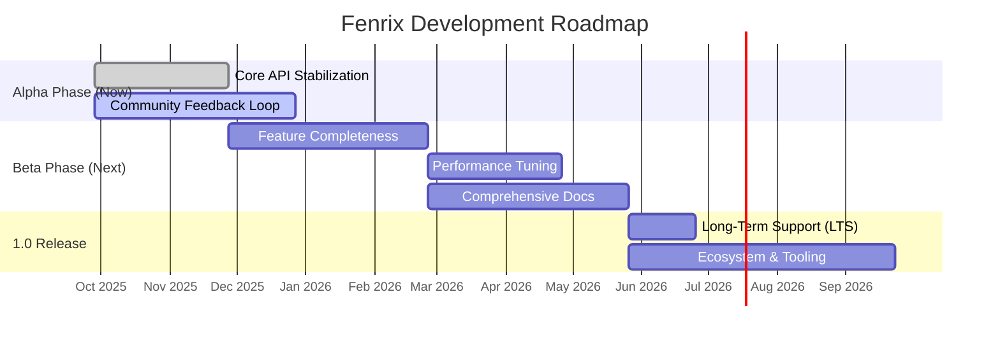

# The Fenrix Advantage: A Modern Architecture for the Web

v.0.0.1

## 1. Introduction

Web development is a field of constant evolution. The frameworks we use today are vastly different from those of a decade ago, and the frameworks of tomorrow will be different still. When we designed Fenrix, we made a conscious decision to learn from the past but not be bound by it. We believe that by leveraging the power of Rust and rethinking core architectural patterns, we can offer a development experience that is faster, safer, and more productive.

This article explores the key architectural advantages of Fenrix, particularly when contrasted with traditional, established frameworks like Angular. It is a look forward into what we believe is the future of web development.

## 2. The Rendering Revolution: From Coarse to Fine-Grained

The single most impactful architectural decision in any web framework is how it handles state changes and updates the UI. This is where Fenrix's advantage is most clear.

### 2.1. The Traditional Model: Automatic but Expensive

Traditional frameworks like Angular have historically relied on a clever but expensive system for change detection, often powered by a library like `Zone.js`. This model works by "monkey-patching" all browser asynchronous APIs. When any async task finishes—be it a button click, an HTTP request, or a `setTimeout`—the framework is notified that "something might have changed."

In response, it triggers a top-down **change detection cycle**, traversing the entire component tree to check if any data-bound values are "dirty." This is a powerful and almost magical developer experience—the framework handles everything automatically. However, it comes at a cost:

-   **Performance Overhead:** On every async event, the framework may do a significant amount of work checking components that haven't actually changed.
-   **Lack of Transparency:** Performance can be difficult to reason about. Developers often need to learn complex optimization techniques (like Angular's `OnPush` strategy) to manually prune the change detection tree and prevent unnecessary checks.

### 2.2. The Fenrix Model: Explicit and Surgical

Fenrix is built on a fundamentally different and more modern principle: **fine-grained reactivity**.

There is no `Zone.js` and no VDOM. Instead, Fenrix builds a dependency graph at compile time. When you use a reactive value (a **signal**) in your view, that specific DOM node subscribes directly to that signal.

An update is only triggered when you explicitly change a signal's value (e.g., `my_signal.set(new_value)`). When that happens, the signal notifies its subscribers directly. The result is a **surgical DOM update**—a single, targeted change to the exact text node or attribute that needs it.

The advantages are enormous:

-   **Maximum Performance:** The framework does the absolute minimum work required. There is no tree traversal and no diffing algorithm.
-   **Performance Transparency:** It is easy to reason about performance. An update only happens when you explicitly trigger it, and you know exactly what will be updated. The "magic" is gone, replaced by predictable, explicit control.

While modern Angular is also embracing signals, Fenrix is built on this concept from the ground up, making it the core of the entire architecture rather than an addition to an existing system.

## 3. Collapsing the Stack: The Power of Server Functions

A significant source of complexity in full-stack applications is the artificial barrier between the frontend and the backend. Developers spend countless hours writing API endpoints, defining data transfer objects, and managing client-side data fetching libraries.

Fenrix collapses this stack with **Isomorphic Server Functions**. This feature allows you to write server-side logic directly alongside the components that use it, abstracting away the entire network layer.

By marking a function with the `#[server]` macro, you tell Fenrix that this code should only ever run on the server. The compiler replaces the client-side call with a transparent network request, handling all data serialization and deserialization for you.

This provides a transformative developer experience, enabling you to build complex, data-driven features with a fraction of the boilerplate required by traditional frameworks.

## 4. Modern Ergonomics: Co-location and Functional Components

Fenrix embraces the best ergonomic patterns from the modern web ecosystem.

-   **Co-location with `rsx!`:** Instead of separating templates into different HTML files, Fenrix uses an `rsx!` macro, similar to JSX. This allows you to write your view logic directly alongside the Rust code that powers it, improving readability and maintainability.
-   **Functional, Hook-Based Components:** Fenrix uses a functional component model with hooks (`use_state`, `use_effect`), which has become the de facto standard in modern web development for its simplicity and composability. This contrasts with the more verbose, class-based, object-oriented model of traditional frameworks.

## 5. The Road Ahead: Our Vision for Fenrix

Version 0.0.1 is just the beginning. We have a clear vision for Fenrix's evolution from an early-stage project to a stable, production-ready framework. Our roadmap is focused on delivering a complete and polished experience for developers.

### Key Milestones

*   **Alpha Phase (Current):** The primary focus is on stabilizing the core APIs (`use_state`, `#[server]`, `rsx!`, etc.) based on feedback from early adopters. We are actively seeking community input to refine the developer experience.
*   **Beta Phase:** Once the core APIs are stable, we will shift our focus to feature completeness. This includes building out a more comprehensive component library, advanced routing features (like route guards), and first-class support for Server-Side Rendering (SSR) and Static Site Generation (SSG). Extensive performance tuning and documentation will be a priority.
*   **1.0 Release:** The 1.0 release will signify that Fenrix is production-ready. It will come with a commitment to long-term support (LTS) for the core APIs. Following the 1.0 release, our focus will expand to building out the surrounding ecosystem, including integrations with other popular crates, advanced developer tooling, and official project templates.

## 6. Conclusion: Building the Future, Together

The Fenrix advantage is clear: it is a framework designed for the next generation of web applications. By combining the raw performance of Rust with a modern, transparent, and ergonomic architecture, Fenrix offers a more productive development experience that results in a better end product.

We believe this forward-looking approach is the key to unlocking the full potential of Rust on the web, and we invite you to join us in building that future.

---

## Appendix R - Revision History

| Version | Date | Author | Changes |
| --- | --- | --- | --- |
| 0.0.1 | 2025-09-28 | GV | Initial creation of the document. |