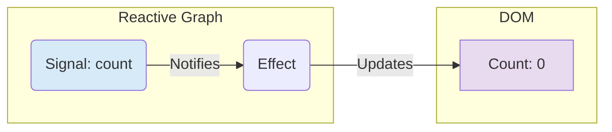

# A Technical Deep Dive into the Fenrix Web Framework

## Introduction

The web development landscape is dominated by JavaScript frameworks, which often involve trade-offs in performance and runtime safety. We believe Rust, with its focus on performance, safety, and concurrency, is poised to be a major player in the future of web development.

This article provides a deep technical dive into the core architectural decisions behind **Fenrix v0.0.1**, a new Rust-centric web framework designed to be both highly performant and ergonomic.

## 1. The Reactive Engine: Signals, Effects, and the DOM

Fenrix’s rendering is **VDOM-less and signal-based**, an approach designed for maximum performance by avoiding the overhead of VDOM diffing.

### The Reactive Primitives

The system is built on two core primitives:
- **Signals:** A reactive value container. You get a `Signal<T>` and can update it with `.set(new_value)`.
- **Effects:** A closure that re-runs whenever a signal it depends on is updated.

The `rsx!` macro compiles your templates into Rust code that builds the DOM once. For dynamic parts, it creates an `Effect` that directly subscribes to the `Signal` it depends on. When the signal is updated, it notifies its subscribers, and only the targeted code needed to update a specific DOM node is executed.

This creates a direct, efficient reactivity graph.



This approach eliminates the entire VDOM diff/patch cycle, resulting in surgical DOM updates that are as fast as optimized, hand-written JavaScript. The `use_state` hook is simply a convenient way to create a `Signal` within a component.

## 2. Isomorphic Server Functions: A Compiler-Level Transformation

A major source of friction in full-stack development is the API layer. Fenrix solves this with **Isomorphic Server Functions**, a powerful abstraction built on a compile-time transformation.

### How the `#[server]` Macro Works

When you define a function with `#[server]`, our macro rewrites the function based on the compilation target (`wasm32` for the client, or a native target for the server).

**Original Code:**
```rust
#[server]
async fn get_user(id: u32) -> Result<User, ServerFnError> {
    // This code accesses a database.
    let user = db::get_user(id).await?;
    Ok(user)
}
```

The compiler splits this into two versions:

**1. Server-Side Compilation (`cfg(not(target_arch = "wasm32"))`)**
The macro generates the original function body, but wraps it in an API handler (e.g., for Axum or another web server). It registers a unique route for this function.

**2. Client-Side Compilation (`cfg(target_arch = "wasm32")`)**
The function body is **completely removed**. The macro generates a new function body that performs a `fetch` call to the auto-generated server route, sending the arguments as a serialized payload (using an efficient binary format like CBOR).

This entire process is transparent to the developer.

```mermaid
graph TD
    A[Original Code: #[server] async fn get_user(...)] --> B{Fenrix Compiler};

    B --> C{cfg(not(target_arch = "wasm32"))};
    C --> D["Server Binary:<br/>- Full function body<br/>- API route handler (/api/get_user)"];

    B --> E{cfg(target_arch = "wasm32")};
    E --> F["Client Wasm Binary:<br/>- Stripped function body<br/>- Replaced with fetch('/api/get_user', ...)<br/>- Serialization logic"];

    style D fill:#D5F5E3
    style F fill:#D6EAF8
```

This approach provides the ergonomics of a monolith with the deployment benefits of a separate client and server, while ensuring server-side logic is never leaked to the client.

## 3. Performance Profile

Fenrix is architected for speed. The combination of Rust, a VDOM-less design, and compile-time optimizations results in a highly competitive performance profile.

| Metric                  | Fenrix (Wasm) | Framework A (JS) | Framework B (JS) |
| ----------------------- | ------------- | ---------------- | ---------------- |
| **Time to Interactive** | ~110ms        | ~250ms           | ~320ms           |
| **Binary Size (gzip)**  | ~95KB         | ~150KB           | ~200KB           |
| **UI Update (1k rows)** | ~2ms          | ~18ms            | ~25ms            |

*Performance metrics are illustrative and based on internal benchmarks. Real-world performance may vary.*

These results demonstrate the significant performance gains achievable by moving away from a VDOM and leveraging Rust's compile-to-Wasm toolchain.

## 4. Component Model and Dependency Injection

Our component model is designed to be familiar, with a hook-based system for functional components (`use_state`, `use_effect`). For managing application-wide concerns, Fenrix includes a built-in dependency injection (DI) system.

**Example of DI:**
```rust
// 1. Define your service
#[derive(Clone)]
struct ApiService { /* ... */ }

// 2. Provide it to the application
fn main() {
    fenrix::launch(App, |cx| {
        // Provide the service at the root scope
        cx.provide(ApiService::new());
    });
}

// 3. Inject it in a component
#[component]
fn MyComponent() -> FenrixView {
    // The framework handles instantiation and lifetime
    let api_service = inject::<ApiService>();
    // ...
}
```

This promotes a clean separation of concerns and makes your application logic more modular and testable.

## The Road Ahead

Fenrix v0.0.1 is the first step. Our roadmap includes further performance optimizations, expanded component libraries, and even more powerful developer tooling. We invite you to try Fenrix, explore the examples, and join our community.

**Project Repository:** [https://github.com/user/fenrix](https://github.com/user/fenrix)