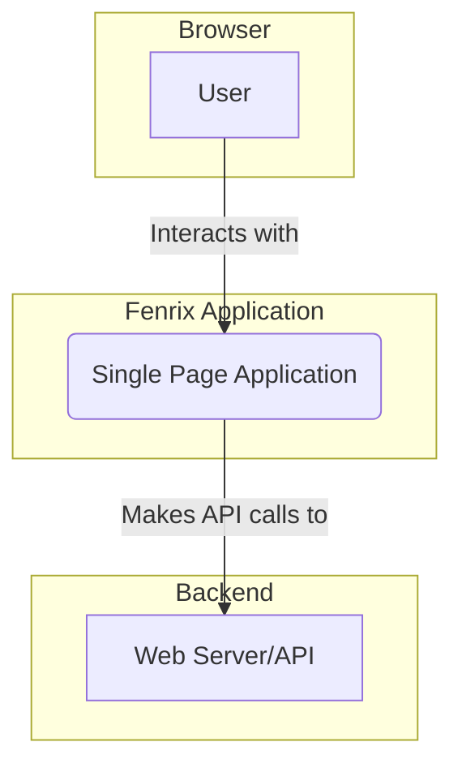
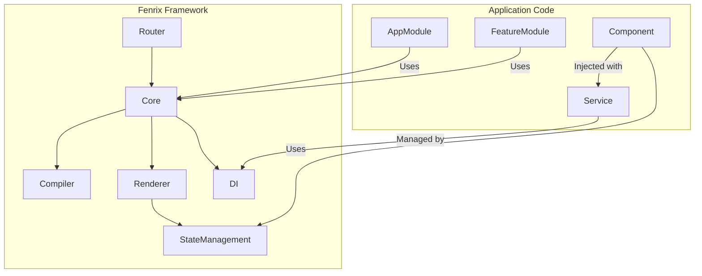
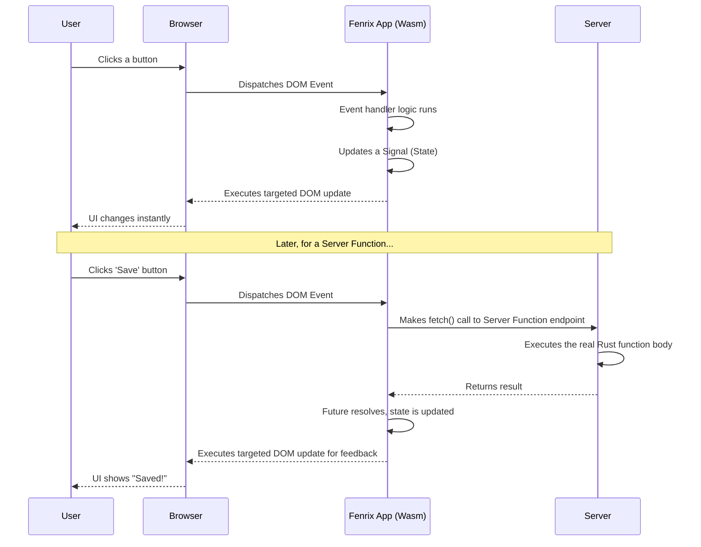
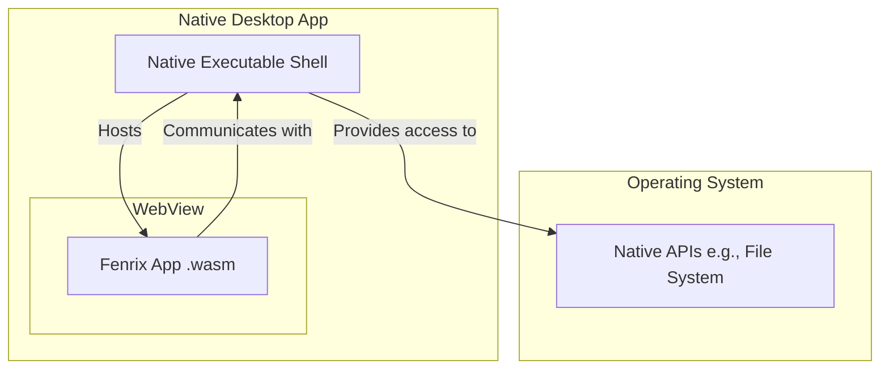

# Fenrix Architecture Specification
v.0.0.01

## Table of Contents
- [1. Introduction](#1-introduction)
  - [1.1. Document Purpose and Audience](#11-document-purpose-and-audience)
  - [1.2. Product/System Overview](#12-productsystem-overview)
  - [1.3. Problem Statement & Vision](#13-problem-statement--vision)
  - [1.4. Goals & Objectives](#14-goals--objectives)
  - [1.5. Definitions, Acronyms, and Abbreviations](#15-definitions-acronyms-and-abbreviations)
  - [1.6. References](#16-references)
- [2. Product & User Requirements](#2-product--user-requirements)
  - [2.1. Target Audience & User Personas](#21-target-audience--user-personas)
  - [2.2. User Scenarios / Use Cases](#22-user-scenarios--use-cases)
  - [2.3. Core Functional Requirements](#23-core-functional-requirements)
  - [2.4. Non-Functional Requirements (Product-Level)](#24-non-functional-requirements-product-level)
  - [2.5. Out-of-Scope Features](#25-out-of-scope-features)
  - [2.6. User-Centric Acceptance Criteria](#26-user-centric-acceptance-criteria)
- [3. System Architecture](#3-system-architecture)
  - [3.1. Architectural Goals & Constraints](#31-architectural-goals--constraints)
  - [3.2. Architectural Principles](#32-architectural-principles)
  - [3.3. System Context Diagram](#33-system-context-diagram)
  - [3.4. Modular Decomposition Diagram](#34-modular-decomposition-diagram)
  - [3.5. Logical View (Component Diagram)](#35-logical-view-component-diagram)
  - [3.6. Process View (Runtime/Concurrency Diagram)](#36-process-view-runtimeconcurrency-diagram)
  - [3.7. Physical View (Deployment Diagram)](#37-physical-view-deployment-diagram)
  - [3.8. Data View (High-Level Schema & Data Flow)](#38-data-view-high-level-schema--data-flow)
  - [3.9. Data Models](#39-data-models)
  - [3.10. Key Architectural Decisions & Rationale](#310-key-architectural-decisions--rationale)
  - [3.11. Architecture Decision Records (ADRs)](#311-architecture-decision-records-adrs)
  - [3.12. Paths Not Taken](#312-paths-not-taken)
  - [3.13. Technical Non-Functional Requirements](#313-technical-non-functional-requirements)
  - [3.14. User Experience (UX) & User Interface (UI) Design](#314-user-experience-ux--user-interface-ui-design)
    - [3.14.1. Key User Journeys / Workflows](#3141-key-user-journeys--workflows)
    - [3.14.2. High-Level Wireframes / Mockups](#3142-high-level-wireframes--mockups)
    - [3.14.3. Interaction Design Overview](#3143-interaction-design-overview)
    - [3.14.4. Visual Design & Style Guide (Overview)](#3144-visual-design--style-guide-overview)
  - [3.15. Component Responsibility Collaborator (CRC) Cards](#315-component-responsibility-collaborator-crc-cards)
  - [3.16. Sequence Diagrams](#316-sequence-diagrams)
  - [3.17. Logging and Monitoring](#317-logging-and-monitoring)
- [4. External Interfaces & Integrations](#4-external-interfaces--integrations)
  - [4.1. External System Interfaces](#41-external-system-interfaces)
  - [4.2. Third-Party Integrations](#42-third-party-integrations)
  - [4.3. API Specifications (External)](#43-api-specifications-external)
- [5. Constraints & Assumptions](#5-constraints--assumptions)
  - [5.1. Technical Constraints](#51-technical-constraints)
  - [5.2. Business Constraints](#52-business-constraints)
  - [5.3. Assumptions](#53-assumptions)
  - [5.4. Dependencies](#54-dependencies)
- [6. Verification & Validation](#6-verification--validation)
  - [6.1. Acceptance Criteria](#61-acceptance-criteria)
  - [6.2. Testability Considerations](#62-testability-considerations)
- [7. Appendices (Optional)](#7-appendices-optional)
  - [7.1. Glossary of Terms](#71-glossary-of-terms)
  - [7.2. Detailed Diagrams](#72-detailed-diagrams)
- [Appendix R - Revision History](#appendix-r---revision-history)

---
*Note: This document is a living document and will be updated throughout the design and development process. The structure is based on the template provided in `agents/DESIGN.md`.*

## 1. Introduction

### 1.1. Document Purpose and Audience
This document provides a comprehensive architectural specification for the Fenrix web framework. It details the system's design, technical principles, core components, and key decisions.

The intended audience for this document includes:
- **Core Framework Developers:** To guide the implementation of the Fenrix framework itself.
- **Software Architects:** To understand the framework's design and how it integrates with other systems.
- **Potential Adopters & Technical Stakeholders:** To evaluate Fenrix's capabilities and suitability for their projects.

### 1.2. Product/System Overview
Fenrix is a full-fledged, Rust-centric web framework for building modern, performant, and dynamic web applications. Written entirely in Rust for applications written in Rust, it is designed to provide a highly ergonomic and productive development experience without sacrificing the raw performance and safety guarantees of the Rust language.

By learning from established giants like Angular and incorporating the best ideas from modern challengers like React, Vue, Blazor, Leptos, and Dioxus, Fenrix aims to deliver a best-in-class platform for web development that is both powerful and a joy to use.

### 1.3. Problem Statement & Vision
**Problem:** The web development ecosystem, while mature, is largely dominated by JavaScript/TypeScript frameworks. While these are powerful, they often come with performance overhead, runtime errors, and a development experience that can be cumbersome (e.g., managing dependencies, state, and build tooling). Rust developers seeking to build web applications currently have a choice between several excellent but still-maturing frameworks, none of which have achieved the full-stack, "batteries-included" scope of a framework like Angular.

**Vision:** The vision for Fenrix is to become a direct, top-tier competitor to established frameworks like Angular, but built on a foundation of Rust. It will be the go-to choice for developers and organizations who want to leverage Rust's performance, reliability, and safety to build next-generation web applications without compromising on developer experience or features.

### 1.4. Goals & Objectives
- **To be Blazingly Fast:** Achieve runtime performance that meets or exceeds the fastest JavaScript frameworks and hand-written vanilla JS code.
- **To Offer a Superlative Developer Experience:** Provide a simple, intuitive API, powerful tooling (CLI), and clear, compile-time error messages.
- **To be Fully Featured:** Include built-in solutions for routing, state management, dependency injection, and internationalization.
- **To Enable Seamless Full-Stack Development:** Allow developers to write frontend and backend logic in the same language, with features like Isomorphic Server Functions abstracting away the client-server boundary.
- **To Foster a Strong Community:** Build a welcoming and supportive community through excellent documentation, tutorials, and open development.

### 1.5. Definitions, Acronyms, and Abbreviations
- **Fenrix:** The name of the web framework.
- **RSX (`rsx!`)**: Rust XML, a macro for writing HTML-like syntax directly in Rust code.
- **Signal:** A reactive primitive that holds a value and automatically notifies subscribers when that value changes. The core of the fine-grained reactivity system.
- **Hook:** A function (e.g., `use_state`, `use_effect`) that lets a component "hook into" Fenrix's features.
- **Server Function:** An `async` function marked with `#[server]` that is defined in shared code but only executes on the server.
- **Wasm:** WebAssembly.
- **JS Interop:** JavaScript Interoperability. The mechanism for calling JS from Wasm and vice-versa.
- **DI:** Dependency Injection.

### 1.6. References
This design synthesizes research from the following pioneering frameworks:
- **Baseline:** Angular
- **User-Friendly Features:** React, Vue, Blazor
- **Rust-Specific Optimizations:** Leptos, Dioxus, Yew

## 2. Product & User Requirements

### 2.1. Target Audience & User Personas
The primary target audience for Fenrix is Rust developers who want to build web applications.

**Persona: "Rusty" Full-Stack Developer**
- **Bio:** A mid-to-senior level developer with a strong background in a backend language like Rust, Go, or C++. They value performance, type safety, and control. They are building a data-intensive dashboard or a public-facing web app and want to use Rust across the entire stack to maximize code reuse and maintain consistency.
- **Needs:** A framework that feels "Rusty" and idiomatic, leverages the compiler for safety, and doesn't hide the underlying mechanisms too much. They need powerful features out-of-the-box to avoid having to piece together a solution from dozens of small libraries.
- **Frustrations:** The complexity and "magic" of JavaScript build tooling; runtime errors in production; slow performance of existing JS frameworks for their demanding applications.

### 2.2. User Scenarios / Use Cases
- **As a developer, I want to create a new, reusable component** so that I can build my UI in a modular way.
- **As a developer, I want to fetch data from a database and display it in a component** so that my application can show dynamic data.
- **As a developer, I want to manage global application state (like the currently logged-in user)** so that different components can share information.
- **As a developer, I want to create different pages and navigate between them** using a client-side router.
- **As a developer, I want to build and deploy my application for production** with a single command from the Fenrix CLI.

### 2.3. Core Functional Requirements
- **Component Model:** A hook-based functional component system using the `#[component]` and `rsx!` macros.
- **Reactivity System:** A fine-grained, signal-based reactivity model for state management.
- **Templating:** The `rsx!` macro with support for expressions, control flow, and data binding.
- **Routing:** A file-based or config-based client-side router.
- **Dependency Injection:** A container for managing and injecting services.
- **Server Functions:** Isomorphic functions for seamless client-server communication.
- **JS Interop:** A safe, asynchronous bridge to JavaScript.
- **CLI:** A command-line interface for project creation, builds, and development servers.

### 2.4. Non-Functional Requirements (Product-Level)
- **Performance:** A "Hello, World!" application should have a First Contentful Paint (FCP) of under 100ms on a standard desktop connection. DOM updates from state changes should be completed within a single frame (<16ms).
- **Bundle Size:** A "Hello, World!" application should have a gzipped Wasm binary size of under 100KB.
- **Developer Experience:** Compile-time errors for invalid templates or type mismatches must be clear and point to the exact location of the error.
- **Documentation:** The framework must have comprehensive documentation covering all public APIs, along with a "getting started" guide and several example projects.

### 2.5. Out-of-Scope Features (for v1.0)
- Native mobile rendering (e.g., targeting iOS/Android without a WebView).
- A visual GUI builder or IDE plugin for drag-and-drop development.
- Official integrations with every major CSS framework (though community integrations will be encouraged).

### 2.6. User-Centric Acceptance Criteria
**Scenario: Building a simple Todo application**
- **Given** a new Fenrix project created via the CLI,
- **When** I create a component to display a list of todos from a `State` vector,
- **Then** the list of todos should render correctly on the screen.
- **And When** I create an input field and a button to add a new todo,
- **Then** typing in the field and clicking the button should add the new todo to the list and the UI should update automatically.
- **And When** I use a Server Function to save the list of todos to a backend database,
- **Then** the function call should be transparent and the data should be persisted on the server.

## 3. System Architecture

### 3.1. Architectural Goals & Constraints
- **Performance:** Fenrix applications must be highly performant, leveraging Rust's zero-cost abstractions, memory safety, and concurrency model to minimize runtime overhead. The goal is to outperform existing JavaScript-based frameworks.
- **Developer Experience:** The framework must provide a development experience that is intuitive, productive, and ergonomic for Rust developers. This includes clear error messages, a powerful CLI, and comprehensive documentation.
- **Modularity:** The architecture must be highly modular, allowing developers to build large-scale, maintainable applications. Unused features should not be included in the final production bundle.
- **Rust-Centric:** The framework will be "Rust first," designed to embrace Rust's idioms and best practices rather than simply mimicking JavaScript frameworks.

### 3.2. Architectural Principles
- **Component-Based Architecture:** The UI will be constructed from a hierarchy of reusable, self-contained components, each with its own logic and view.
- **Declarative UI:** Developers will declare the desired state of the UI, and the framework will be responsible for efficiently updating the DOM to match that state.
- **Reactivity:** State changes will automatically propagate through the application, triggering UI updates. This will be achieved through a fine-grained reactive system.
- **Dependency Injection:** A built-in dependency injection system will be used to manage and provide services and other dependencies to components, promoting decoupled and testable code.

### 3.3. System Context Diagram


### 3.4. Modular Decomposition Diagram


### 3.5. Logical View (Component Diagram)
This section outlines the core architectural components of the Fenrix framework, inspired by Angular but adapted for Rust.

#### 3.5.1. Rendering Architecture: Signal-Based and VDOM-Less
To achieve maximum performance and align with Rust's principles of efficiency, Fenrix will adopt a **signal-based, Virtual DOM-less rendering architecture**, inspired by the most modern Rust-native frameworks like Leptos.

This architecture fundamentally differs from traditional VDOM-based frameworks:
1.  **Compile-Time Render Tree:** The `rsx!` macro is not used to build a virtual tree at runtime. Instead, it is compiled into an efficient routine that creates the real DOM elements *once* and returns them to the user.
2.  **Reactive Scopes:** During this initial creation, the compiler identifies any dynamic parts of the view (e.g., `{user_name}`). It wraps these parts in a **reactive scope** and subscribes them to the specific reactive primitive (`State<T>` or signal) they depend on.
3.  **Surgical DOM Updates:** When a signal's value is updated (e.g., `user_name.set(...)`), it does *not* re-render the entire component. It simply notifies its subscribers. The framework then executes only the small, targeted function needed to update the specific text node, attribute, or property in the real DOM.

This approach completely eliminates the need for runtime VDOM creation, diffing, and patching, which are significant sources of overhead in other frameworks. It results in updates that are as fast as hand-written, optimized vanilla JavaScript.

#### 3.5.2. Component Model
The core building block of a Fenrix application is the **Component**. A component is a Rust struct that encapsulates the logic and state for a piece of the UI. Following the best practices of modern frameworks like Vue and React, Fenrix adopts a **Single-File Component** philosophy, where a component's logic, view, and styles are co-located.

- **Component Definition:** Components will be defined using a `#[component]` attribute macro. This macro processes a Rust struct and an associated `rsx!` macro block, generating the necessary code for rendering, change detection, and lifecycle management.

```rust
// Conceptual Example
use fenrix::prelude::*;

#[component]
fn UserProfile(user_id: u32) -> FenrixView {
    let user_service = inject::<UserService>();
    let user_name = use_state(|| String::new());

    // Side-effect hook for data fetching
    use_effect(move || {
        let user = user_service.get_user(user_id);
        user_name.set(user.name);
    }, ());

    rsx! {
        <div class="user-profile">
            <h2>"User Profile"</h2>
            <p>"Name: "{*user_name}</p>
            <button (click)={move |_| user_name.set("New Name".to_string())}>
                "Rename"
            </button>
        </div>
    }
}
```

- **Lifecycle & Side-Effect Hooks:** Instead of a rigid set of lifecycle methods, Fenrix will provide **Hooks**, inspired by React. These are functions (like `use_state` and `use_effect`) that allow function components to "hook into" the framework's state and lifecycle features. This provides a more flexible and composable way to manage state and side effects (like API calls or manual DOM event listeners). Key hooks will include:
    - `use_state`: Declares a reactive piece of state.
    - `use_effect`: Executes side-effect code after the component renders, and re-runs it only when its dependencies change. This is the primary mechanism for interacting with external systems.

#### 3.5.3. State Management
Fenrix will provide a built-in, fine-grained reactivity system inspired by SolidJS and Leptos, but with the developer-friendliness of Vue's and React's state management.

- **Reactive Primitives (Signals):** State will be managed through reactive primitives like `use_state<T>`. When the value returned by this hook is modified (e.g., via `.set()`), only the specific parts of the UI that depend on it are re-rendered. This surgical precision avoids the need for a Virtual DOM diffing algorithm and provides optimal performance.

#### 3.5.4. Templating (RSX - Rust XML)
Fenrix will use a custom **RSX (Rust XML)** macro, `rsx!`, inspired by JSX. This allows developers to write HTML-like syntax directly inside their Rust component functions.

- **RSX Syntax:** The syntax is designed to be familiar to anyone who has used HTML, but with the full power of Rust expressions available within curly braces `{}`.

```rust
// Conceptual RSX Example
rsx! {
    <div class="container">
        <h1 style={"color: blue;"}>"My Title"</h1>
        {
            if *is_loading {
                rsx! { <p>"Loading..."</p> }
            } else {
                rsx! { <MyComponent data={some_data} /> }
            }
        }
        <ul>
            {
                // Iterate and create a list of nodes
                items.iter().map(|item| rsx!{ <li>{item}</li> }).collect::<Vec<_>>()
            }
        </ul>
    </div>
}
```

- **Compile-Time Transformation:** The `rsx!` macro is not interpreted at runtime. During compilation, it is transformed into highly optimized Rust code that builds the UI components and sets up the reactive bindings. This compile-time approach catches errors early, improves performance, and ensures type safety between component logic and the view.

#### 3.5.5. Data Binding
The framework will support several forms of data binding:
- **Interpolation `{{ value }}`:** One-way binding to render a value from the component's logic as text in the view.
- **Property Binding `[property]="value"`:** One-way binding to pass data from a parent component to a child component or to set an element's property.
- **Event Binding `(event)="handler()"`:** Binds a DOM event to a method in the component's logic.
- **Two-Way Binding `[(property)]="value"`:** A combination of property and event binding for synchronizing state between the component and the view, typically on form inputs.

#### 3.5.6. Rendering Architecture
The rendering engine is responsible for converting the component tree into DOM elements.
1.  **AOT Compilation:** Templates are compiled into Rust code.
2.  **Initial Render:** On application startup, the root component is rendered, creating the real DOM elements and setting up reactive bindings.
3.  **Reactive Updates:** When a `State<T>` primitive is updated, it notifies its subscribers.
4.  **Targeted DOM Updates:** The rendering engine receives the notification and updates only the specific DOM nodes that are affected by the state change. This fine-grained approach avoids diffing a virtual tree, providing maximum performance.

#### 3.5.7. Modules and Dependency Injection
Inspired by `NgModule`, Fenrix will have a module system for organizing the application and managing dependency injection.
- **Modules:** A `#[module]` macro will define a module, which declares components, provides services, and imports other modules.
- **Dependency Injection:** Services are registered with an injector, typically at the module level. Components can then request instances of these services through a hook like `inject<T>()`. The framework's DI system is responsible for creating and "injecting" the service instance.

#### 3.5.8. JavaScript Interoperability (JS Interop)
While Fenrix aims to enable full-stack Rust development, seamless integration with the existing JavaScript ecosystem and browser APIs is essential. Fenrix will provide a robust and safe **JS Interop** layer.

- **Asynchronous by Design:** All calls from Rust to JavaScript will be asynchronous, returning a `Future`. This is necessary to accommodate the JavaScript event loop and ensure compatibility with both client-side and potential server-side rendering models.
- **`JSRuntime` Service:** A built-in service, `JSRuntime`, will be injectable into components and other services. This service will provide methods to invoke JavaScript functions.

```rust
// Conceptual Example
async fn play_audio(js: Inject<JSRuntime>) {
    js.invoke_void("playAudioFile", &["/audio/notification.mp3"]).await;
}
```

- **Warning Against DOM Manipulation:** The JS Interop layer is intended for calling non-DOM-manipulating JavaScript functions (e.g., interacting with a charting library's data API, calling a browser's Web Share API). Direct manipulation of the DOM via JS Interop is strongly discouraged, as it will bypass Fenrix's render tree and can lead to an inconsistent UI state. This will be a prominent warning in the framework's documentation.

#### 3.5.9. Isomorphic Server Functions
To create a truly seamless full-stack development experience, Fenrix will provide **Server Functions**. These are `async` Rust functions that can be defined anywhere in the application code (including right next to a component) but are guaranteed to only execute on the server.

- **`#[server]` Macro:** A `#[server]` attribute macro marks a function as a server function. The Fenrix compiler will then perform a transformation:
    1.  The body of the function is compiled exclusively into the server-side binary.
    2.  In the client-side Wasm binary, the function body is replaced with a transparent network call (e.g., a `fetch` request) to an automatically generated API endpoint that executes the function on the server.

```rust
// Conceptual Example
#[server]
async fn get_user_name(user_id: u32) -> Result<String, ServerFnError> {
    // This code ONLY runs on the server.
    // It can safely access databases, secrets, etc.
    let db = connect_to_database().await?;
    let user = db.get_user(user_id).await?;
    Ok(user.name)
}

// In a component:
fn UserView(user_id: u32) -> FenrixView {
    let user_name = use_resource(move || get_user_name(user_id));
    // ...
}
```
- **Benefits:** This approach eliminates the need for developers to manually create and manage REST or GraphQL APIs for communication between their frontend and backend, drastically simplifying full-stack development.

### 3.6. Process View (Runtime/Concurrency Diagram)
This diagram illustrates the flow of control at runtime for both a simple client-side interaction and a full client-server interaction using a Server Function.



### 3.7. Physical View (Deployment Diagram)
The primary deployment target for Fenrix is the web browser, compiling the Rust application to a WebAssembly (Wasm) binary.

#### 3.7.1. Web Deployment
```mermaid
graph TD
    subgraph Client Browser
        Wasm[Fenrix App .wasm]
        JS[JS Glue Code]
        DOM
    end
    subgraph CDN/Web Server
        StaticFiles[HTML, CSS, JS, Wasm]
    end
    StaticFiles -- Served to --> Client Browser
    Wasm -- Manipulates --> DOM
    Wasm -- Interacts via --> JS
```

#### 3.7.2. Desktop Deployment
For desktop applications, Fenrix will follow the lightweight and efficient model of using a system's native **WebView**. This avoids bundling a full browser engine, resulting in significantly smaller application sizes.
- **Mechanism:** The Fenrix application is compiled to a native executable. This executable opens a native OS window containing a WebView, which then loads and runs the Wasm application.
- **Communication:** Communication between the Wasm application and native system APIs (e.g., file system, notifications) will be handled through a dedicated interop layer provided by the desktop shell.



### 3.8. Data View (High-Level Schema & Data Flow)
Data flow in Fenrix is designed to be unidirectional and easy to reason about.

```mermaid
graph TD
    subgraph Client-Side
        View(DOM)
        Logic[Component Logic]
        State[Reactive State (Signals)]

        View -- DOM Events --> Logic
        Logic -- Updates --> State
        State -- Reactively Updates --> View
    end

    subgraph Server-Side
        ServerFn[Server Function]
        DB[(Database)]
    end

    Logic -- Calls --> ServerFn
    ServerFn -- Interacts with --> DB
    ServerFn -- Returns Data --> Logic
```

### 3.9. Data Models
Fenrix itself is unopinionated about the application's data models. Developers are free to define their data using standard Rust `struct`s and `enum`s.

For data that needs to be passed between the client and server (i.e., as arguments to or return values from Server Functions), the types must implement `serde::Serialize` and `serde::Deserialize`. The framework will recommend using popular serialization formats like JSON or a more performant binary format like MessagePack.

### 3.10. Key Architectural Decisions & Rationale
- **Decision:** Adopt a component-based architecture heavily inspired by Angular.
  - **Rationale:** Angular's architecture is mature, well-documented, and proven for building large-scale, complex applications. Its concepts of modules, components, services, and dependency injection provide a strong foundation for separation of concerns and maintainability. By using it as a baseline, we can learn from its strengths while improving upon its weaknesses (e.g., performance) by leveraging Rust.
- **Decision:** Use Rust attribute macros (`#[component]`, `#[module]`) for metadata.
  - **Rationale:** This is the idiomatic Rust equivalent of TypeScript decorators. It allows for declarative configuration that is checked at compile time, improving safety and developer experience.
- **Decision:** Implement a fine-grained reactive system for state management using Hooks.
  - **Rationale:** This is a more modern and performant approach than Angular's traditional zone.js-based change detection. Adopting a hook-based system (`use_state`, `use_effect`) inspired by React provides a more ergonomic and composable way to manage state and side effects compared to a class-based lifecycle model. It allows for surgical precision in DOM updates, which is a key goal for achieving best-in-class performance.
- **Decision:** Adopt an inline `rsx!` macro for templating instead of separate HTML files.
  - **Rationale:** This approach, inspired by React's JSX and championed by Vue's Single-File Components, provides superior developer ergonomics by co-locating the view with its corresponding logic. The `rsx!` macro, processed at compile-time, ensures that UI is type-safe and fully integrated with Rust's language features, eliminating a whole class of runtime errors common in traditional templating.
- **Decision:** Provide a formal, asynchronous JavaScript Interoperability (JS Interop) layer.
  - **Rationale:** As a WebAssembly framework, providing a safe and ergonomic "escape hatch" to the JavaScript world is critical for accessing browser APIs and leveraging the vast ecosystem of existing JS libraries. Following the model of Blazor, this interop layer will be asynchronous by design and will strongly discourage direct DOM manipulation to prevent state desynchronization with Fenrix's internal render tree.
- **Decision:** Adopt Isomorphic Server Functions.
  - **Rationale:** Inspired by Leptos, this feature provides an unparalleled ergonomic advantage for full-stack development. It allows developers to write server-side logic (like database queries) directly alongside the client-side components that use them. The `#[server]` macro abstracts away the entire network API layer, making the developer experience seamless and reducing boilerplate.

### 3.11. Architecture Decision Records (ADRs)
ADRs will be created and stored in a separate `/adr` directory as significant architectural decisions are made during the implementation phase.

### 3.12. Paths Not Taken
- **Virtual DOM (VDOM) Rendering:** While a proven and powerful technology used by frameworks like React and Dioxus, the VDOM was consciously not chosen as the primary rendering strategy for Fenrix. A VDOM-based approach inherently involves runtime overhead for creating a virtual representation of the DOM, diffing it against a previous version, and generating a list of patches to apply to the real DOM.
  - **Reason for Rejection:** The primary architectural goal for Fenrix is maximum performance. A signal-based, VDOM-less architecture avoids the entire VDOM lifecycle, allowing state changes to translate directly into surgical updates on the real DOM. This approach promises faster updates, lower memory consumption, and a smaller Wasm binary size, which aligns more closely with the efficiency principles of Rust. While more complex to implement in the compiler, the end-user and developer benefits are significant.

### 3.13. Technical Non-Functional Requirements
- **Security:**
    - **Cross-Site Scripting (XSS) Prevention:** All string data rendered into the DOM via standard interpolation (`{my_string}`) will be automatically sanitized. An explicit, dangerously-named API (`dangerously_set_inner_html`) will be provided for cases where rendering raw HTML is required, forcing the developer to acknowledge the risk.
    - **Cross-Site Request Forgery (CSRF) Protection:** Server Functions that mutate state (e.g., via HTTP POST) must be protected. The framework will provide a mechanism, likely token-based, to mitigate this risk.
- **Scalability:**
    - **Code Splitting:** The framework's build tooling must support code splitting on a per-route or per-component basis, allowing for lazy loading of Wasm code to keep initial load times fast for large applications.
- **Reliability & Error Handling:**
    - The framework itself must not `panic!` under normal operation.
    - Errors from fallible operations, especially Server Functions or JS Interop, must be exposed to the developer as `Result` types, enabling robust error handling logic within components.

### 3.14. User Experience (UX) & User Interface (UI) Design
As Fenrix is a framework, it does not have its own UI. However, it will promote best practices for building accessible and user-friendly applications.

#### 3.14.1. Key User Journeys / Workflows
This will be developed via example applications, such as a "TodoMVC" or "RealWorld" implementation.

#### 3.14.2. High-Level Wireframes / Mockups
Not applicable for a framework.

#### 3.14.3. Interaction Design Overview
The framework will encourage the use of standard HTML semantics and provide tools to easily manage focus, ARIA attributes, and keyboard navigation.

#### 3.14.4. Visual Design & Style Guide (Overview)
Fenrix will be style-agnostic, allowing developers to use plain CSS, CSS-in-JS libraries, or utility-class frameworks like Tailwind CSS. Documentation will provide guides for integrating with popular styling solutions.

### 3.15. Component Responsibility Collaborator (CRC) Cards
CRC cards will be developed for the core internal concepts (e.g., `Renderer`, `Scheduler`, `Injector`) during the implementation phase to clarify responsibilities.

### 3.16. Sequence Diagrams
Detailed sequence diagrams for internal processes like the render and update cycles will be created as part of the detailed implementation design.

### 3.17. Logging and Monitoring
- **Logging Strategy:**
  - **Log Levels:** The framework will support an 8-level logging system: Emergency, Alert, Critical, Error, Warning, Notice, Informational, Debug.
  - **Default Level:** The default logging level for applications will be `NOTICE`.
  - **Configuration:** The logging level will be configurable at application launch via environment variables.
  - **Output:** Logs will be directed to the browser console (using `console.log`, `console.error`, etc.) and will be color-coded by severity for readability.
- **Monitoring Strategy:**
  - The framework will provide hooks to integrate with performance monitoring tools. Key metrics to expose will include component render times, change detection cycles, and memory usage.

## 4. External Interfaces & Integrations

### 4.1. External System Interfaces
- **Browser DOM:** The primary external interface, managed by the framework's renderer.
- **JavaScript Engine:** Interfaced with via the JS Interop layer.
- **Backend APIs:** Any HTTP-based API can be called from Fenrix applications, but the primary mechanism for first-party backends is Server Functions.

### 4.2. Third-Party Integrations
- **JavaScript Libraries:** Any JS library can be integrated via the JS Interop layer.
- **Rust Crates:** Any Rust crate that compiles to the `wasm32-unknown-unknown` target can be used within a Fenrix application's logic.

### 4.3. API Specifications (External)
Fenrix does not expose an external API itself, but it enables the creation of them via Server Functions, which automatically generate HTTP endpoints.

## 5. Constraints & Assumptions

### 5.1. Technical Constraints
- **Target Environment:** The primary target is modern web browsers that support WebAssembly.
- **Toolchain:** The framework will rely on the official Rust toolchain (`cargo`) and `wasm-pack`/`wasm-bindgen`.

### 5.2. Business Constraints
- The project is open-source and will be developed by the community. Timelines are not fixed.

### 5.3. Assumptions
- Users of the framework have a working knowledge of Rust.
- The web browser environment will continue to improve its Wasm support and performance.
- A signal-based reactive model will provide a significant performance benefit over a VDOM for the majority of web application use cases.

### 5.4. Dependencies
- **`wasm-bindgen`:** For core Rust-to-JS communication.
- **`serde`:** For serialization/deserialization in Server Functions.
- **`tokio` (or similar):** For the server-side runtime executing Server Functions.

## 6. Verification & Validation

### 6.1. Acceptance Criteria
The framework will be considered "v1.0" when a developer can build, test, and deploy a full-stack application (e.g., the RealWorld example) that meets the non-functional requirements for performance and bundle size.

### 6.2. Testability Considerations
The architecture must facilitate testing at multiple levels:
- **Unit Tests:** Services and utility functions can be tested as standard Rust code.
- **Component Tests:** The framework will provide a test harness to render components in a headless environment, allowing for assertions against the rendered output and interaction simulation.
- **End-to-End (E2E) Tests:** Fenrix applications can be tested with standard E2E testing tools like Playwright or Cypress.

## 7. Appendices (Optional)

### 7.1. Glossary of Terms
This will be populated as the documentation is written.

### 7.2. Detailed Diagrams
This will be populated with more detailed internal diagrams during implementation.

---

## Appendix R - Revision History
| Version | Date       | Author      | Changes                               |
|---------|------------|-------------|---------------------------------------|
| 0.0.01  | 2025-09-26 | GV       | Initial creation and population of the document. |